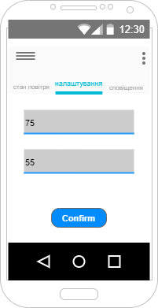

| NFR ID | Test Case ID | Опис кроків тестового сценарію                                                                                | Опис очікуваних результатів |
|--------|--------------|---------------------------------------------------------------------------------------------------------------|-----------------------------|
| NFR1.1 | TC1.6        | Початкові умови: відсутні Кроки сценарію: відсутні                                                        |          |
| NFR1.1 | TC1.7        | Початкові умови: успішно пройдено TC1.6 Кроки сценарію:  1) рівень забрудненності повітря = 75  2) рівень вологості = 55|          |
| NFR1.1 | TC1.8        | Початкові умови: успішно пройдено TC1.7 1) Натиснуто кнопку «Confirm»                                        |          |