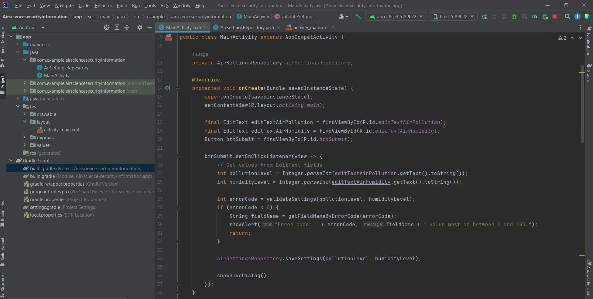

### Рисунок 1 - Фрагмент використання IDE MongoDB зі створення БД та колекції

### Рисунок 2-4 - Фрагменти написання методів для вводу налаштувань та їх валідації

### Рисунок 5 - Фрагмент написання екранної форми налаштувань науковця
